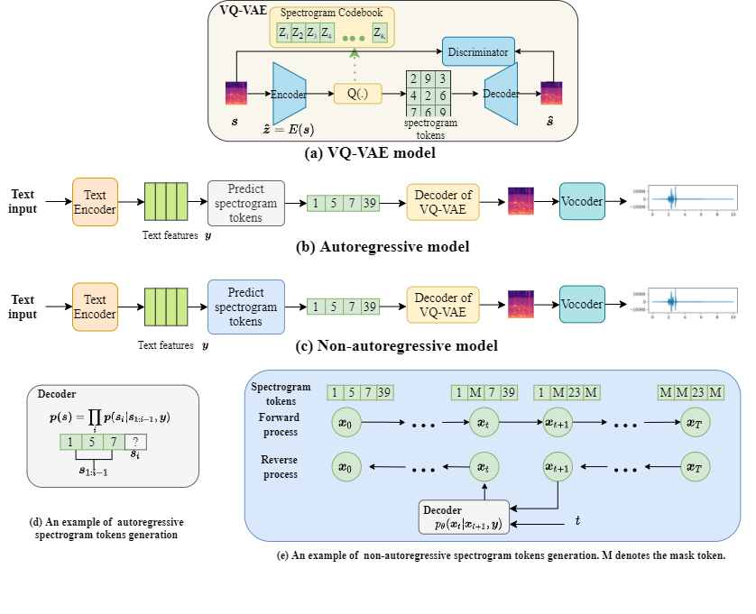

# Text-to-sound Generation
This is the open source code for our paper "Diffsound: discrete diffusion model for text-to-sound generateion".  
**2022/08/03** We upload the training code of VQ-VAE and the baseline method of text-to-sound generation (Autoregressive model), and the Diffsound code. Considering that the github has the limitation of file size, we will upload the pre-trained model on google drive disk.  
**2022/08/06** We uppoad the pre-trained model on google drive. please refer to https://drive.google.com/drive/folders/193It90mEBDPoyLghn4kFzkugbkF_aC8v?usp=sharing  
Note that a pre-trained diffsound model is very large, so that we only upload one audioset pretrained model now. More models we will try to upload on other free disk, if you known any free shared disk, please let me know, I will very appreciate.
**2022/08/09** We upload trained diffsound model on audiocaps dataset, and the baseline AR model, and the codebook trained on audioset with the size of 512. You can refer to https://pan.baidu.com/s/1R9YYxECqa6Fj1t4qbdVvPQ . The password is **lsyr**  
More details will be updated as soon as.
## Overview

## Pretrained Model
We release four text-to-sound pretrained model. Including VQVAE trained on Audioset, Vocoder trained on Audioset, generation model trained on Audiocaps and Audioset.

## Inference
Please refer the readme.md file in Codebook folder to see how to inference.

## Training
Please refer the readme.md file in Codebook folder to see how to train your network.
## Reference
This project based on following open source code.
https://github.com/XinhaoMei/ACT
https://github.com/cientgu/VQ-Diffusion
https://github.com/CompVis/taming-transformers
https://github.com/lonePatient/Bert-Multi-Label-Text-Classification
https://github.com/v-iashin/SpecVQGAN
## Cite 
@article{yang2022diffsound,
  title={Diffsound: Discrete Diffusion Model for Text-to-sound Generation},
  author={Yang, Dongchao and Yu, Jianwei and Wang, Helin and Wang, Wen and Weng, Chao and Zou, Yuexian and Yu, Dong},
  journal={arXiv e-prints},
  pages={arXiv--2207},
  year={2022}
}
